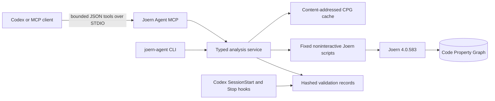

# Joern Agent Bridge

Joern Agent Bridge gives OpenAI Codex and other MCP clients focused,
machine-readable access to a real [Joern](https://joern.io/) Code Property Graph
(CPG). It favors bounded, source-evidenced questions over dumping an entire graph
into an LLM context window.

## Why graph-aware agents

Source text is excellent for understanding intent, but control flow, dominance,
reachability, call graphs, and interprocedural data flow are graph questions. This
project gives each part of the toolchain a clear responsibility:

- The LLM chooses focused questions, interprets evidence, edits code, and discloses
  uncertainty.
- Joern constructs and queries the CPG.
- The compiler, tests, linters, and runtime checks validate language and behavior.



## Fedora installation

The verified workstation installation uses Fedora 44, OpenJDK 25.0.3, Graphviz
14.1.4, Python 3.14, and Joern 4.0.583. Joern upstream identifies JDK 21 as its
tested baseline and says newer JDKs may work; Fedora 44's supported OpenJDK 25
works for the included real integration tests.

```bash
sudo dnf install graphviz java-25-openjdk-devel python3-devel pipx gcc gcc-c++ make
scripts/install-joern
pipx install .
```

`scripts/install-joern` downloads the pinned official release archive before
execution, verifies its GitHub-published SHA-256 digest, extracts it under
`~/.local/share/joern/v4.0.583`, and links safe commands under `~/.local/bin`.
The local installation report records the exact checks.

On other Linux distributions, install a supported JDK, Python 3.11+, Graphviz,
`gcc`, `g++`, `curl`, `unzip`, and `pipx`, then use the same user-scoped scripts.
Do not use `sudo pip`.

## Quickstart

```bash
joern-agent doctor --json
joern-agent parse examples/c-demo --language c --json
joern-agent methods examples/c-demo --json
joern-agent cfg examples/c-demo --method process_request --json
joern-agent callers examples/c-demo --method process_request --json
joern-agent callees examples/c-demo --method process_request --json
joern-agent controls examples/c-demo --method process_request --json
joern-agent dataflow examples/c-demo \
  --source process_request --sink unsafe_sink --max-depth 20 --max-paths 10 --json
```

Create lifecycle evidence before and after graph-sensitive edits:

```bash
scripts/joern-snapshot baseline
# edit source and repeat focused Joern queries
scripts/joern-snapshot post
scripts/joern-compare
scripts/joern-check
```

These repository wrappers default to the `python` frontend because the bridge itself
is Python. Set `JOERN_LANGUAGE=c` when applying the same workflow to the C fixture.

## CLI

`joern-agent` provides `doctor`, `parse`, `methods`, `search-methods`, `cfg`,
`neighbors`, `callers`, `callees`, `controls`, `dominators`,
`post-dominators`, `loops`, `unreachable`, `call-paths`, `dataflow`, `export`,
`snapshot`, `compare`, `validate`, and `mcp`. Query commands accept explicit
timeouts and result/node/depth/path bounds. `--json` provides stable
machine-readable output. Failures use nonzero exit status.

## MCP tools

The `joern-agent-mcp` executable opens STDIO only—never a network port. Tools are:

- `joern_health`, `joern_supported_languages`, `joern_parse_project`
- `joern_list_methods`, `joern_search_methods`, `joern_get_method_cfg`
- `joern_get_cfg_neighbors`, `joern_get_callers`, `joern_get_callees`
- `joern_get_control_dependencies`, `joern_get_dominators`,
  `joern_get_post_dominators`
- `joern_find_call_paths`, `joern_find_dataflow_paths`
- `joern_find_loops`, `joern_find_unreachable_nodes`
- `joern_export_graph`, `joern_create_snapshot`, `joern_compare_snapshots`

Every tool uses the real adapter. Schemas document confinement, cost, bounds,
source evidence, and common failure modes. Large exports are written to artifact
files and return only a summary.

## Codex integration, trust, and hooks

The checked-in `.codex/config.toml` makes Joern a required project MCP server,
and `.codex/hooks.json` registers deterministic `SessionStart` and `Stop` hooks.
Codex loads project configuration and project hooks only after the repository is
trusted. Hook definitions must also be reviewed with `/hooks` when first seen or
changed. Start a fresh session after installation:

```bash
cd /home/epi13/Documents/Projects/joern-agent-bridge && codex
```

The Stop hook ignores documentation-only edits. For graph-sensitive source
changes it verifies successful baseline and post snapshots and exact current
source-state and diff hashes. Missing, failed, malformed, or stale evidence blocks
completion. A repeated invocation with `stop_hook_active` reports the failure
without creating an infinite continuation loop.

See [Codex integration](docs/codex-integration.md) and root [AGENTS.md](AGENTS.md).

## CPG cache and snapshots

CPGs live under the user cache directory, never in Git. Cache keys include resolved
source root, source content, exact Joern version, language, and configuration.
Writes use interprocess locks; reads reuse immutable content-addressed entries.
Snapshots record the repository commit, source and diff hashes, Joern version,
frontend, query definitions, methods, CFG summaries, call relations, control
dependencies, warnings, timeouts, status, phase, and timestamp.

## Supported languages

The installed Joern 4.0.583 reports these frontend identifiers:
`abap`, `c`, `csharp`, `csharpsrc`, `fuzzy_test_lang`, `ghidra`, `golang`,
`java`, `javasrc`, `javascript`, `jssrc`, `kotlin`, `llvm`, `newc`, `php`,
`python`, `pythonsrc`, `rubysrc`, `rust`, and `swiftsrc`.

The adapter's tested automatic source-state mappings currently cover C/C++, Java,
JavaScript/TypeScript, Python, Kotlin, and PHP. CI's mandatory real integration
fixture is C because Joern documents that frontend as very high maturity.

## Security model

All subprocesses use argument arrays, absolute executable paths, a small
environment allowlist, process groups, hard timeouts, and bounded output. Source
and artifact paths are resolved before use, confined to approved roots, and reject
symlink escapes. Joern scripts expose a fixed operation allowlist; user input never
becomes Scala or shell source. CPG writes are locked. The MCP server is local STDIO.

Static analysis is not a proof system. Joern frontends, call resolution, type
recovery, and data-flow semantics can produce false positives and false negatives.
Indirect calls, macros, native boundaries, reflection, exceptions, and unsupported
language constructs deserve explicit caveats. See the [threat model](docs/threat-model.md).

## Performance

Parsing and data-flow queries can be CPU- and memory-intensive. Use method filters
and small bounds. Cached CPGs avoid repeat parsing. Joern may need a larger JVM heap
for large repositories (for example `-J-Xmx8G` in a controlled wrapper); this
project does not silently raise memory limits. Exports can be large and are written
to ignored artifact directories.

## Development and CI

```bash
python3 -m venv .venv
.venv/bin/pip install -e '.[dev]'
.venv/bin/ruff format --check .
.venv/bin/ruff check .
.venv/bin/mypy src
.venv/bin/pytest
.venv/bin/python -m build
.venv/bin/pip-audit
```

GitHub Actions installs and verifies the pinned Joern release, runs health,
formatting, lint, types, unit and real integration tests, MCP and hook tests,
coverage, package build, dependency audit, and Bandit-oriented Ruff rules. It uses
least-privilege permissions and uploads only safe test artifacts.

## Troubleshooting

- `joern not found`: ensure `~/.local/bin` is on `PATH`, then run
  `scripts/install-joern`.
- Java warnings: OpenJDK 25 emits upstream restricted/deprecated API warnings;
  distinguish warnings from nonzero Joern exit status.
- `path_outside_approved_roots`: launch the MCP server from the repository root or
  set `JOERN_AGENT_APPROVED_ROOTS` to a deliberate path list.
- no data-flow path: confirm source/sink regexes, frontend support, types, and Joern
  semantics; absence is not proof of safety.
- project hooks skipped: trust the repository, start a fresh Codex session, and
  review `/hooks`.
- stale validation: rerun the post snapshot and `scripts/joern-check` after the
  latest source edit.

## Upgrade

Find the desired official Joern release and its published `joern-cli.zip` SHA-256,
then run:

```bash
scripts/upgrade-joern vX.Y.Z SHA256 SHA512
```

Update the pin and digest in `scripts/install-joern`, CI, the installation report,
and release notes together; rerun all real integration tests before committing.

## Uninstall

The detailed, reversible procedure is in
[docs/fedora-installation-report.md](docs/fedora-installation-report.md#uninstall).
For this exact installation:

```bash
pipx uninstall joern-agent-bridge
rm -f ~/.local/bin/joern ~/.local/bin/joern-parse ~/.local/bin/joern-export \
  ~/.local/bin/joern-scan ~/.local/bin/joern-slice ~/.local/bin/joern-flow
rm -rf ~/.local/share/joern/v4.0.583 ~/.cache/joern/v4.0.583 \
  ~/.cache/joern-agent-bridge
```

Then remove only the marked `joern` MCP table from `~/.codex/config.toml`, only
the marked Joern section from `~/.codex/AGENTS.md`, and any marked PATH section
if one was added. Restore timestamped backups if preferred. Fedora packages
installed solely for this project are listed in the installation report and can be
removed with `sudo dnf remove`.

## License

Apache License 2.0. See [LICENSE](LICENSE).
